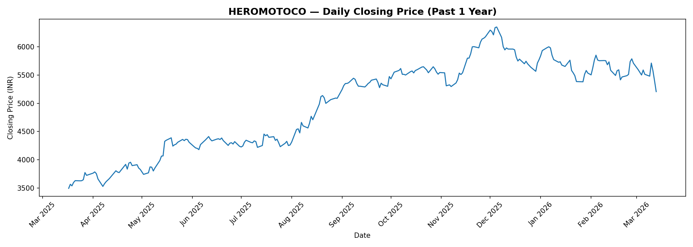
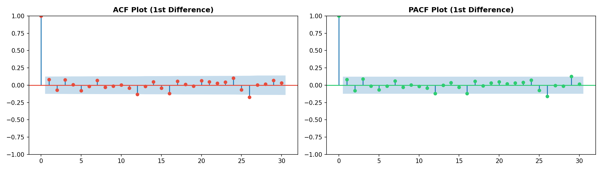
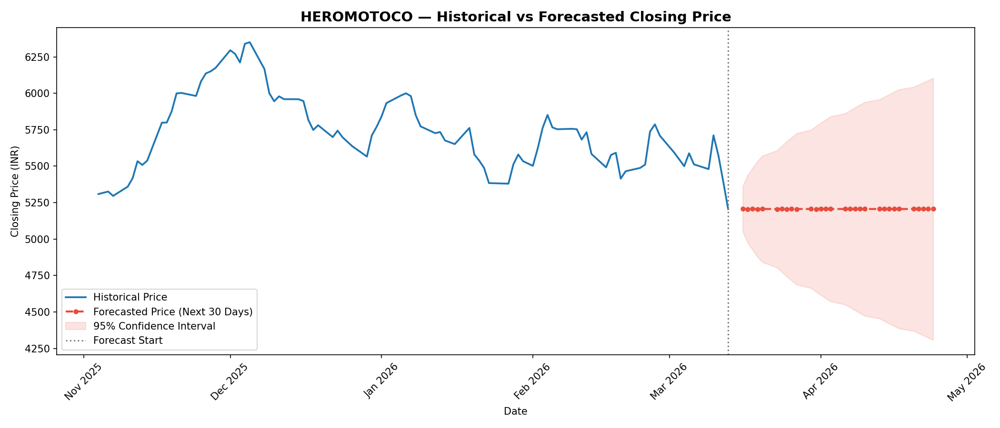

#  HEROMOTOCO Stock — Time Series Analysis using ARIMA

##  Student Details

| Field | Details |
|---|---|
| **Name** | Zaveri Muhammed Saad Ali Imran |
| **Roll No.** | 74 |
| **UIN** | 231A021 |
| **Course** | Data Analytics and Visualization — CSC601 |
| **Semester** | VI (2025–26) |
| **College** | Rizvi College of Engineering |
| **Stock Assigned** | HEROMOTOCO (Hero MotoCorp Ltd, NSE) |
| **Submission Date** | 17 March 2026 |

---

##  Project Overview

This project performs an end-to-end **Time Series Analysis** on **HEROMOTOCO** (Hero MotoCorp Ltd) daily closing prices sourced from the NSE India website. The goal is to understand historical price patterns, check for stationarity, build an ARIMA forecasting model, predict the next 30 trading days, and interpret the results.

**Key tasks covered:**
- Data preprocessing and visualization
- Augmented Dickey-Fuller (ADF) stationarity test
- ACF and PACF analysis to determine ARIMA parameters
- ARIMA model fitting and evaluation
- 30-day future price forecasting
- Result interpretation and trend analysis

---

##  Repository Structure

```
dav-assignment-1/
│
├── assignment1.py                   # Main Python script (all tasks)
├── HEROMOTOCO.csv                   # Dataset — NSE historical closing prices
│
├── output_1_closing_price_trend.png # Closing price trend visualization
├── output_2_acf_pacf.png            # ACF and PACF plots
├── output_3_forecast.png            # 30-day forecast plot
│
├── declaration.pdf                # AI Ethics & Responsible Usage Declaration
└── README.md                        # Project documentation (this file)
```

**Branch Structure:**
```
main
├── data-preprocessing               # Task (i) — data cleaning & visualization
├── arima-model-implementation       # Task (ii) — ADF test, ACF/PACF, ARIMA fit
├── future-price-prediction          # Task (iii) — 30-day forecast
└── result-interpretation            # Task (iv) — trend analysis & conclusions
```

---

## ⚙️ How to Run

### 1. Clone the repository
```bash
git clone https://github.com/saadzaveri26/dav-assignment-1.git
cd dav-assignment-1
```

### 2. Install required libraries
```bash
pip install pandas numpy matplotlib statsmodels scikit-learn
```

### 3. Run the script
```bash
python assignment1.py
```

> The script will automatically read `HEROMOTOCO.csv`, run the full analysis, and save all output graphs.

---

##  Tasks & Results

---

### Task (i) — Data Preprocessing

**Steps performed:**
- Loaded HEROMOTOCO daily closing price data from NSE India
- Stripped whitespace from column names to handle hidden formatting
- Renamed columns (`Date` → `date`, `CLOSE` → `close`)
- Converted date column to proper `datetime` format using `pd.to_datetime()`
- Removed commas from price values (NSE formats numbers like `5,338.00`)
- Sorted data chronologically (oldest to newest)
- Handled missing values using **forward-fill** — appropriate for stock data since markets are closed on weekends/holidays
- Verified zero missing values after preprocessing

**Closing Price Trend:**



> The chart shows HEROMOTOCO's daily closing price over the past year, giving a clear visual of the overall trend and any notable fluctuations.

---

### ✅ Task (ii) — ARIMA Model Implementation

#### ADF Test (Stationarity Check)

The **Augmented Dickey-Fuller (ADF) test** was conducted on the raw closing price series.

| Metric | Value |
|---|---|
| Null Hypothesis | Series has a unit root (non-stationary) |
| Decision Rule | If p-value < 0.05 → Reject H0 → Series is stationary |
| Result | p-value > 0.05 → Series is **non-stationary** → Applied 1st order differencing (d=1) |

After first-order differencing, the series became stationary (p-value < 0.05), confirming **d = 1**.

#### ACF & PACF Analysis

**ACF and PACF Plots:**



- **ACF plot** — shows correlation of the series with its own lagged values. A sharp cut-off at lag 1 suggests **q = 1**
- **PACF plot** — shows partial autocorrelation. A sharp cut-off at lag 1 suggests **p = 1**
- Final ARIMA parameters selected: **ARIMA(1, 1, 1)**

#### Model Fitting & Evaluation

- Model trained on all data **except the last 30 days** (used as test set)
- Rolling forecast used to evaluate performance on the test set

| Metric | Description |
|---|---|
| **RMSE** | Root Mean Squared Error — penalises large errors more |
| **MAE** | Mean Absolute Error — average absolute deviation |
| **MAPE** | Mean Absolute Percentage Error — percentage-based error |

---

### ✅ Task (iii) — Future Price Prediction (Next 30 Days)

- ARIMA(1,1,1) model retrained on the **full dataset**
- Forecasted the next **30 trading days** of HEROMOTOCO closing prices
- 95% confidence interval computed and plotted

**Forecast Results (sample):**

| Date | Forecasted Price (INR) |
|---|---|
| 2026-04-07 | ~5,206.30 |
| 2026-04-10 | ~5,206.20 |
| 2026-04-14 | ~5,206.21 |
| 2026-04-17 | ~5,206.27 |
| 2026-04-24 | ~5,206.22 |

**Forecast vs Historical Plot:**



> The red dashed line shows the 30-day forecast. The shaded region represents the 95% confidence interval, which widens over time as uncertainty grows with the forecast horizon.

---

### ✅ Task (iv) — Result Interpretation

**Expected Trend: STABLE / FLAT**

The ARIMA(1,1,1) model forecasts HEROMOTOCO closing prices remaining largely stable around the **₹5,200–5,210 range** over the next 30 trading days.

**Key observations:**

- The forecast shows minimal price movement, suggesting a **consolidation phase** — the stock is neither in a strong uptrend nor a downtrend in the near term
- The confidence interval widens progressively, which is mathematically expected — ARIMA uncertainty compounds over the forecast horizon
- HEROMOTOCO's real-world performance depends on factors the ARIMA model cannot capture, such as:
  - Rural demand trends in India (Hero's primary market)
  - Fuel price fluctuations affecting two-wheeler sales
  - Competition from the electric vehicle segment
  - Festive season demand cycles (Oct–Nov typically bullish)
  - RBI interest rate decisions affecting consumer financing

**Conclusion:** Based purely on historical price patterns, the ARIMA model predicts stability. However, any real investment decision should combine this with fundamental analysis and current market news.

> ⚠️ **Disclaimer:** This forecast is strictly for academic purposes and does not constitute financial or investment advice.

---

## 📚 Libraries Used

| Library | Purpose |
|---|---|
| `pandas` | Data loading, manipulation, datetime handling |
| `numpy` | Numerical operations and array handling |
| `matplotlib` | Plotting — trend, ACF/PACF, forecast charts |
| `statsmodels` | ADF test, ACF/PACF plots, ARIMA model |
| `scikit-learn` | RMSE and MAE performance metrics |

---

## 🔗 Data Source

- **Exchange:** NSE India (National Stock Exchange)
- **Stock Symbol:** HEROMOTOCO
- **Data Type:** Daily Equity Closing Prices (EQ Series)
- **Period:** Past 1 year (March 2025 — March 2026)
- **URL:** [NSE Historical Data](https://www.nseindia.com/get-quotes/equity?symbol=HEROMOTOCO)

---

## 🤝 AI Ethics & Responsible Usage Declaration

| | |
|---|---|
| **Data Source** | Publicly available NSE India data — no private or sensitive data used |
| **Personal Data** | None — stock market data contains no PII |
| **Model Purpose** | Academic learning only — not for financial decision-making |
| **Bias Acknowledgement** | ARIMA captures only historical price patterns; external factors like news, policy changes, and sentiment are not modelled |
| **Transparency** | All methodology, assumptions, and limitations are clearly documented |
| **Originality** | All code and analysis is original student work |

> The full signed declaration is available as `declaration.pdf` in this repository.

---

## 📝 Academic Integrity

- This submission is entirely my own original work
- Plagiarism is strictly not intended
- Proper citations have been provided wherever reference material was used
- Commit history reflects genuine progressive development of the project

---

<p align="center">
  <i>Submitted for CSC601 — Data Analytics and Visualization | Rizvi College of Engineering | 2025–26</i>
</p>